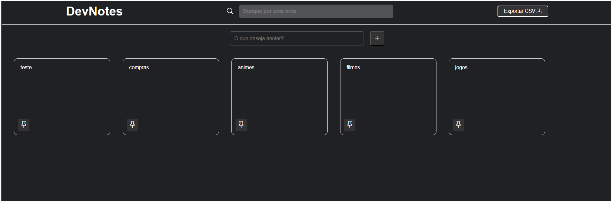
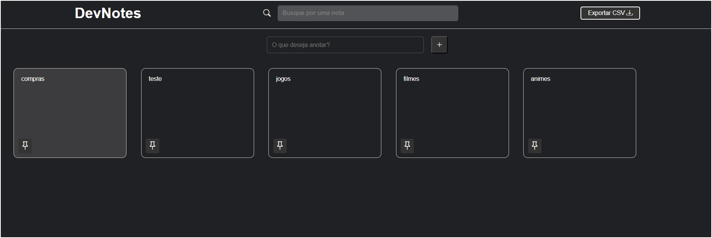
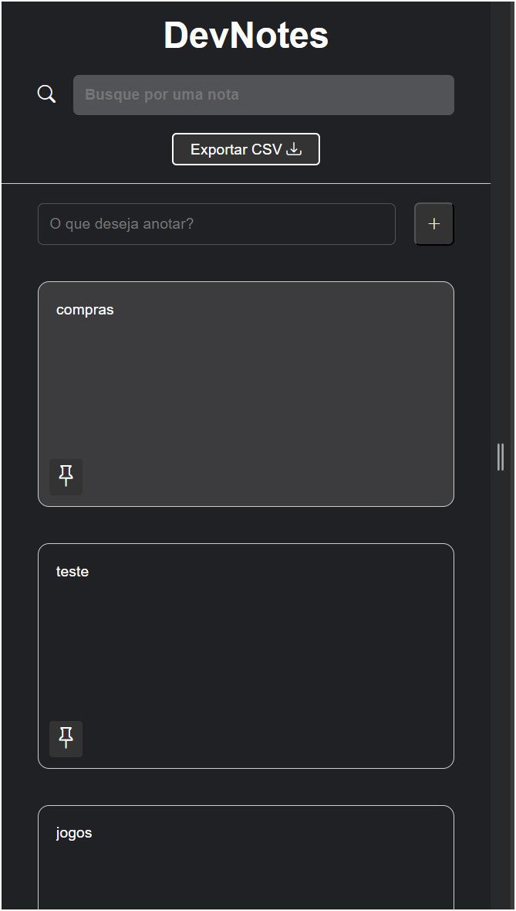

# Note Avançado 
Um Note avançado, com funcionalidades avançadas, feito no curso do Matheus Battisti


## Funcionalidades

- Incluir nota
- Editar nota
- Deletar nota
- Duplicar nota
- Pesquisar e filtrar as notas
- As notas são salvas no LocalStorage
- Exportar em CSV
- Responsividade 
Mais funcionalizas mais tarde...

## Screenshots





## Rodando localmente

Clone o projeto

```bash
  git clone  https://github.com/Henrique1601/Dev-notes
```

## Stack utilizada

**Front-end:** HTML, CSS, JavaScript


## Autores

- [@HenriqueBezerra](https://github.com/Henrique1601)